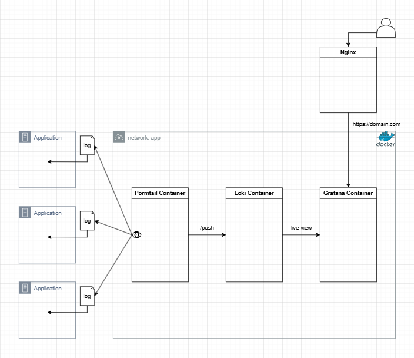

# log_server_docker
## 설명
> loki + grafana + promtail + docker-compose 를 이용한 로그 모니터링 서버 구축


## 개발 과정 및 이해


1. `application` 내에 `log file` 생성 (winston)
2. 생성된 log file을 `promtail contaniner` 에서 catch
3. 캐치한 log 데이터를 `loki container` 에게 push
4. push 된 데이터를 `grafana container` 에게 제공


## grafana loki Query
[promtail.conf](promtail-config.yml) 에서 설정한 `job name` 으로 application log 구분
```
loki query

{job="your_job_name"}
```
> 원하는 프로젝트의 전체로그 확인

```
loki query

{job="your_job_name"} |= "7c9b1247-1bd9-4946-aff6-a232dd1daa2b"
```
> 원하는 프로젝트의 특정 string 포함된 로그 확인

## prometheus
[prometheus.yml](prometheus.yml) 에서 설정한 `job name` 으로 application metrics 구분

## 주의사항
- 각 컨테이너들은 `app network` 에 속해져 있다
- `loki container` 접근 시 `localhost:3100` 가 아닌 `loki:3100` 으로 접근한다


> ❗ 개발, 운영서버 배포시 `app domain` , `grafana domain` 셋팅